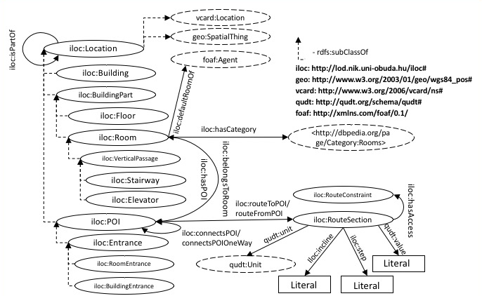

# iLOC

Outdoor navigation is widely available nowadays, and helps people to find a place while driving or walking or using public transport. This type of navigation is usually based on coordinates provided by GPS. Inside buildings, however, a navigation system has to cope with more complex routes using floors, elevators and staircases in the lack of GPS signals. The current solutions usually require special and expensive hardware for positioning. Thus, opposed to the outdoor scenario, there is no single, accepted basic methodology for navigation. The authors work on an inexpensive and simple indoor navigation solution, that can be adopted by large buildings even with low budget (such as universities). For this, we would like to exploit the possibilities of Linked Data and SPARQL for building flexible APIs providing location and routing information. The main use case is supporting students at a university in finding their next lecture (although this use case is quite similar to doing shopping in a mall or checking in at an airport).

The objective of our ontology is to support the publishing of indoor location and navigation data as Linked Open Datasets and to support the development of applications using them. The ontology facilitates locations description and links to relevant data. It can also describe how two places are connected including distance or constraints (e.g. wheelchairs cannot pass). The goal was to create a generic and extendable ontology, which can be applied to any public building. Examples include (but are not limited to) university buildings, major shopping malls, airports or railway stations, government buildings. Our requirements also include the low cost of implementation of such a dataset, as well as the support of a very broad usage (e.g. a solution should not require any special device to consume and leverage the data).

The following is a diagram of the iLOC classes and properties:



## Simple navigation based on the building structure

The first option is based on the structure of the building (and based on the iloc:isPartOf property) and provides simple instructions like 
>Enter the main building. Go to the 3rd floor. Look for Office 307.

The following is an example SPARQL query to select a high-level route between two rooms (even between different buildings). The query builds on the iloc:isPartOf property hierarchy and calculates an instruction in the ?helptext variable.

```
prefix iloc: <http://lod.nik.uni-obuda.hu/iloc#>
prefix rdfs: <http://www.w3.org/2000/01/rdf-schema#>
SELECT DISTINCT ?helptext ?sl ?fl1 ?b1 ?b2 ?fl2 ?el where {
  BIND (<room1> AS ?start ).
  BIND (<room2> AS ?end).
  OPTIONAL {?start rdfs:label ?sl.}
  OPTIONAL {?floor1 rdfs:label ?fl1.}
  OPTIONAL {?floor2 rdfs:label ?fl2.}
  OPTIONAL {?building1 rdfs:label ?b1.}
  OPTIONAL {?building2 rdfs:label ?b2.}
  OPTIONAL {?end rdfs:label ?el.}
  ?start iloc:isPartOf ?floor1.
  ?floor1 iloc:isPartOf ?building1.
  ?end iloc:isPartOf ?floor2.
  ?floor2 iloc:isPartOf ?building2.
 FILTER (?building1 = ?building2 ||?floor1 = ?floor2) .
BIND (if( ?building1 = ?building2 , "same building, different floor", if( ?floor1 = ?floor2 , "same floor", "different building")) AS ?helptext) .
}
```
## Navigation based on POI networks

The second option builds on the top of the structural description, introducing special points in the space: "Point of Interest (POI)". One POI instance is connected to one or multiple other POI by the iloc:connectsPOI property. The route is a chain of POIs within the POI network. As Rooms can be the target of a navigation task, it is important to relate them to the POI network. The iloc:belongsToRoom and iloc:hasPOI properties are responsible to connect the rooms to the POI network by the nearby or including POIs. The second approach is more aligned to instructions one would expect asking someone familiar with the building: 
> Enter the main hall. Pass the coffee machine. Go to the elevator. Go to the 2nd floor. Pass the restrooms. Look for Room 212. 

While the second approach allows more accurate navigation, there is the extra cost of modeling the POI network compared to the first approach.
The following is an example SPARQL query to select the shortest (least intermediate steps) route between two rooms in the same or different building (with maximum length of 3 steps for brevity):
```
PREFIX iloc: <http://lod.nik.uni-obuda.hu/iloc#>
PREFIX rdfs: <http://www.w3.org/2000/01/rdf-schema#>
SELECT ?distance ?sl ?l1 ?l2 ?l3 ?el WHERE {
BIND (<room1> AS ?start ).
BIND (<room2> AS ?end).
OPTIONAL {?start rdfs:label ?sl.}
OPTIONAL {?p1 rdfs:label ?l1.}
OPTIONAL {?p2 rdfs:label ?l2.}
OPTIONAL {?p3 rdfs:label ?l3.}
OPTIONAL {?end rdfs:label ?el.}
?p1 iloc:belongsToRoom ?start.
?p1 iloc:connectsPOI ?p2.
?p2 iloc:connectsPOI ?p3.
?plast iloc:belongsToRoom ?end.
FILTER (?p3 = ?plast || ?p2 = ?plast || ?p1 = ?plast )
BIND (if( ?p3 = ?plast , 3, if( ?p2 = ?plast , 2, if( ?p1 = ?plast , 1, -1))) AS ?distance)
} ORDER BY ?distance LIMIT 1
```

## Advanced navigation based on POI networks

The iLOC Ontology supports more advanced navigation techniques, where the routes sections can be further described as restricted, one-way or by metrics to provide length or time duration between them. These are enabled by the RouteSection class: a RouteSection instance is associated to two POIs by the iloc:routeToPOI and iloc:routeFromPOI properties. A RouteSection might be linked to RouteConstraint instances (for example having a badge or physical ability). The QUDT ontology adds metrics to the route sections by the qudt:unit and qudt:value properties. The QUDT ontology also defines a set of units to reuse.

The following is an example SPARQL query to select the shortest route between two rooms in a building (with maximum length of three steps for brevity):
```
PREFIX iloc: <http://lod.nik.uni-obuda.hu/iloc#>
PREFIX rdfs: <http://www.w3.org/2000/01/rdf-schema#>
PREFIX qudt: <http://qudt.org/schema/qudt#>
SELECT DISTINCT ?sl ?l1 ?d1 ?l2 ?d2 ?l3 ?d3 ?el (?d1+?d2+?d3 AS ?distance) WHERE {
  BIND (<room1> AS ?start ).
  BIND (<room2> AS ?end).
  OPTIONAL {?start rdfs:label ?sl.}
  OPTIONAL {?p1 rdfs:label ?l1.}
  OPTIONAL {?p2 rdfs:label ?l2.}
  OPTIONAL {?p3 rdfs:label ?l3.}
  OPTIONAL {?p4 rdfs:label ?l4.}
  OPTIONAL {?end rdfs:label ?el.}
  ?start iloc:hasPOI ?p1.
  ?r1 iloc:routeFromPOI ?p1.
  ?r1 iloc:routeToPOI ?p2.
  ?r1 qudt:value ?d1.
  ?r2 iloc:routeFromPOI ?p2.
  ?r2 iloc:routeToPOI ?p3.
  ?r2 qudt:value ?d2.
  ?r3 iloc:routeFromPOI ?p3.
  ?r3 iloc:routeToPOI ?p4.
  ?r3 qudt:value ?d3.
  ?p4 iloc:belongsToRoom ?end.
} ORDER BY ?distance LIMIT 1
```

## Papers mentioning iLOC

http://doi.org/10.12700/APH.14.1.2017.1.8

```
@article{MTMT:3253920,
	title = {Indoor Navigation for Motion Disabled Persons in Medical Facilities},
	url = {https://m2.mtmt.hu/api/publication/3253920},
	author = {Fleiner, Rita Dominika and Szász, Barnabás and Simon-Nagy, Gabriella and Micsik, András},
	doi = {10.12700/APH.14.1.2017.1.8},
	journal-iso = {ACTA POLYTECH HUNG},
	journal = {ACTA POLYTECHNICA HUNGARICA},
	volume = {14},
	unique-id = {3253920},
	issn = {1785-8860},
	year = {2017},
	eissn = {1785-8860},
	pages = {111-128},
	orcid-numbers = {Micsik, András/0000-0001-9859-9186}
}
```

https://eprints.sztaki.hu/8851

```
@CONFERENCE{MTMT:3129867,
	title = {iLOC - Building In-Door Navigation Servicesusing Linked Data},
	url = {https://m2.mtmt.hu/api/publication/3129867},
	author = {Szász, Barnabás and Fleiner, Rita Dominika and Micsik, András},
	booktitle = {SEMPDS-2016 Posters&Demos@SEMANTiCS 2016 and SuCCESS'16 Workshop},
	unique-id = {3129867},
	year = {2016},
	pages = {1-4},
	orcid-numbers = {Micsik, András/0000-0001-9859-9186}
}
```
